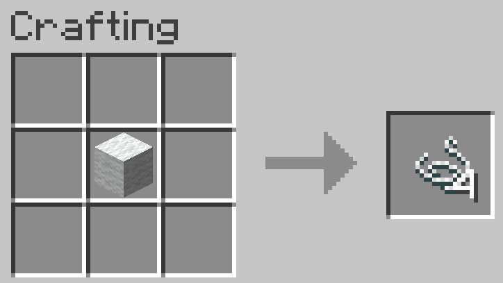
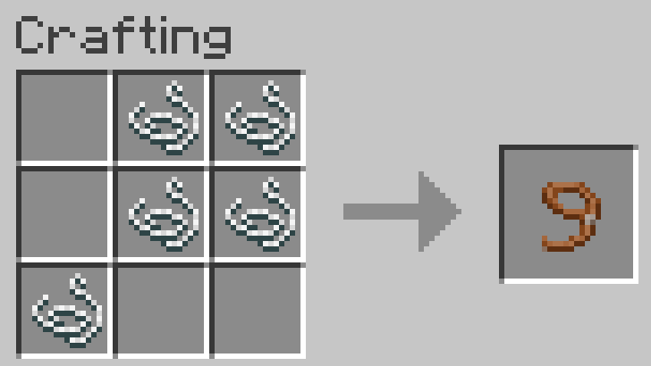
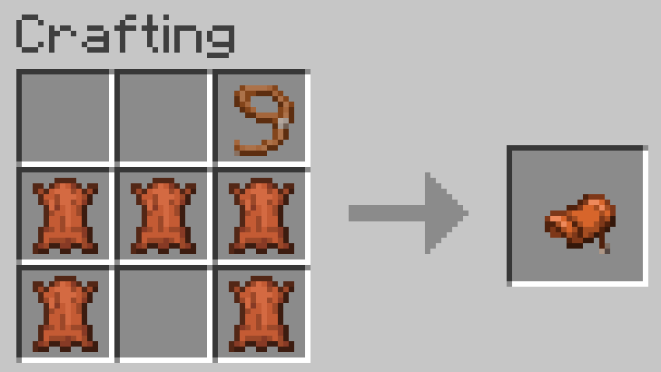
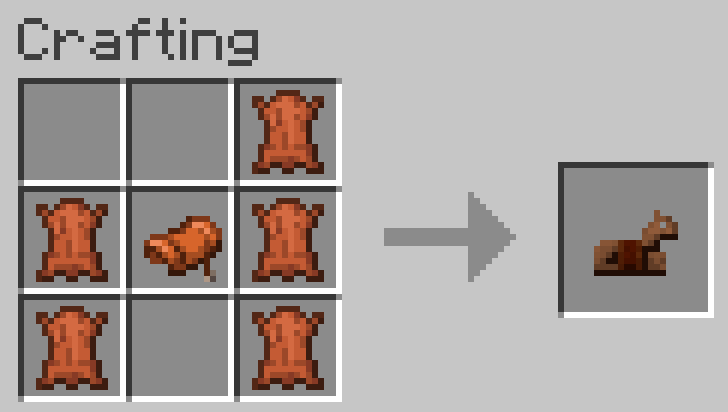
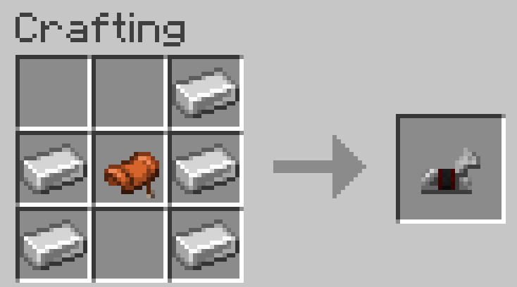
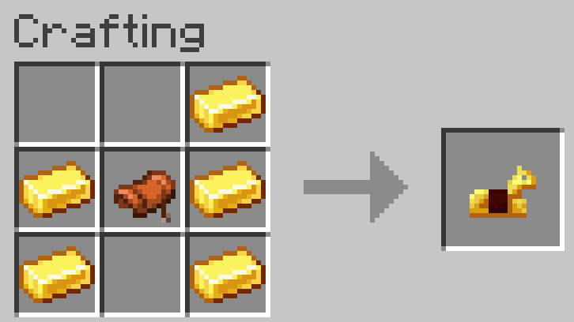
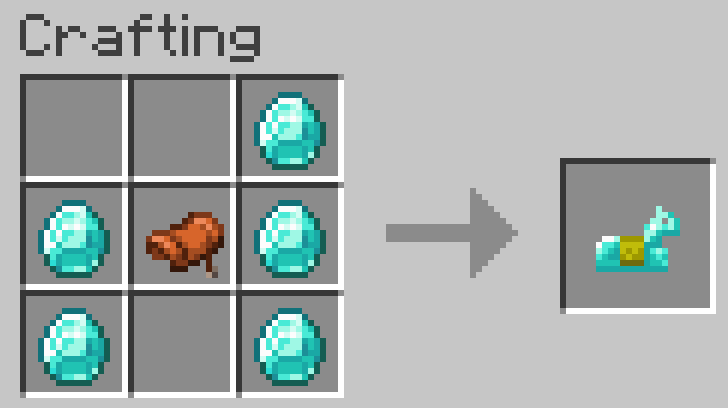
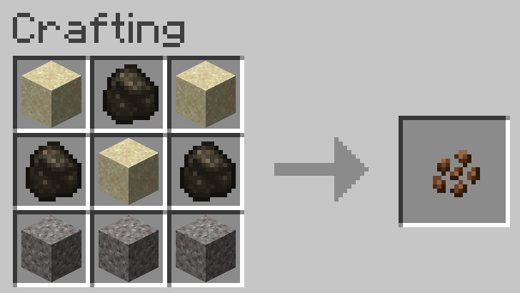
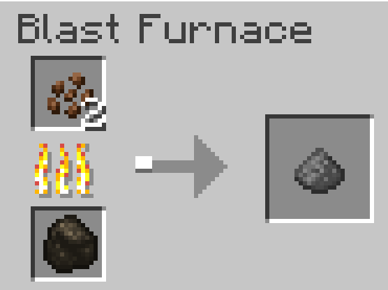

# :blue_book: Custom Recipes

## String

{ width="75%" height=75% }

|       |        |       |
| ----- | ------ | ----- |
| `AIR` | `AIR`  | `AIR` |
| `AIR` | `Wool` | `AIR` |
| `AIR` | `AIR`  | `AIR` |

## Lead

{ width="75%" height=75% }

|          |          |          |
| -------- | -------- | -------- |
| `AIR`    | `STRING` | `STRING` |
| `AIR`    | `STRING` | `STRING` |
| `STRING` | `AIR`    | `AIR`    |

## Saddle

{ width="75%" height=75% }

|           |           |           |
| --------- | --------- | --------- |
| `AIR`     | `AIR`     | `LEAD`    |
| `LEATHER` | `LEATHER` | `LEATHER` |
| `LEATHER` | `AIR`     | `LEATHER` |

## Horse Armor

{ width="75%" height=75% }
{ width="75%" height=75% }
{ width="75%" height=75% }
{ width="75%" height=75% }

|                                   |          |                                   |
| --------------------------------- | -------- | --------------------------------- |
| `AIR`                             | `AIR`    | `LEATHER`/`IRON`/`GOLD`/`DIAMOND` |
| `LEATHER`/`IRON`/`GOLD`/`DIAMOND` | `Saddle` | `LEATHER`/`IRON`/`GOLD`/`DIAMOND` |
| `LEATHER`/`IRON`/`GOLD`/`DIAMOND` | `AIR`    | `LEATHER`/`IRON`/`GOLD`/`DIAMOND` |

## Gunpowder

First you will need to craft `SULFUR` (note obtain `CHARCOAL` by cooking `LOGS`)

{ width="75%" height=75% }

|            |            |            |
| ---------- | ---------- | ---------- |
| `SAND`     | `CHARCOAL` | `SAND`     |
| `CHARCOAL` | `SAND`     | `CHARCOAL` |
| `LEATHER`  | `AIR`      | `LEATHER`  |

Then heat the sulfur in a blast furnace to produce gunpowder

{ width="75%" height=75% }

| BLAST FURNACE |
| ------------- |
| `SULFUR`      |
| :fire:        |
| `COAL`        |

