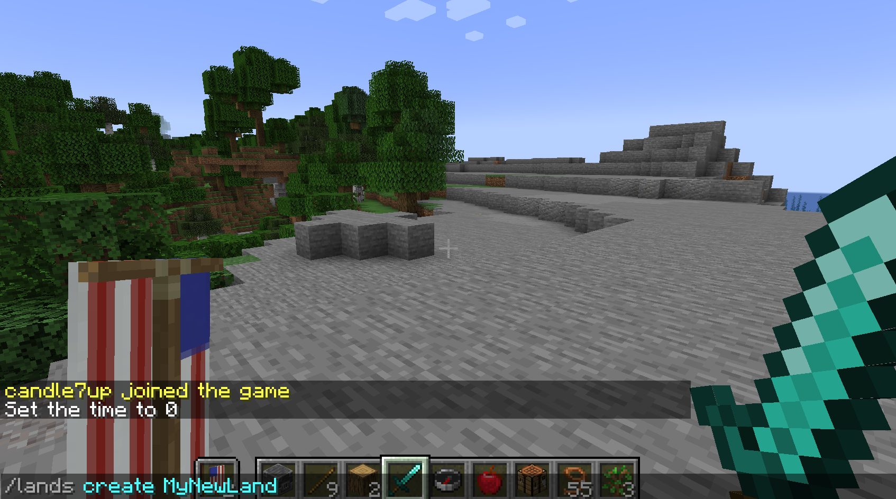
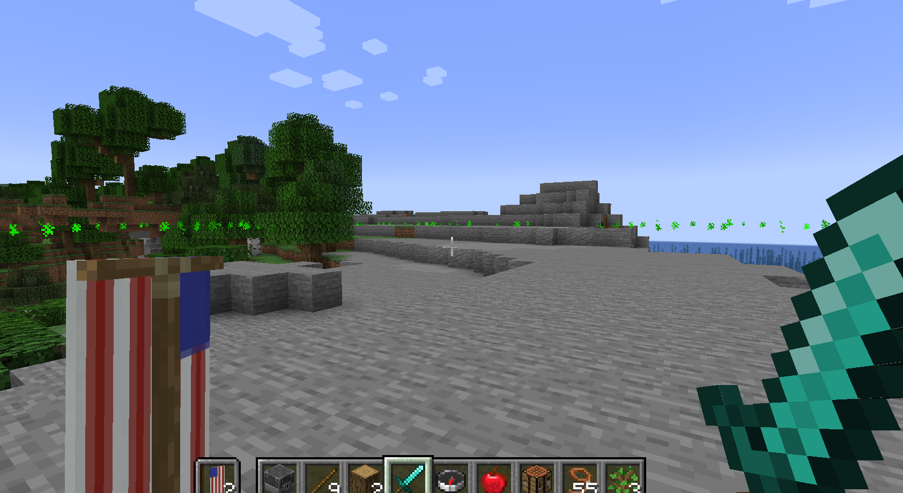
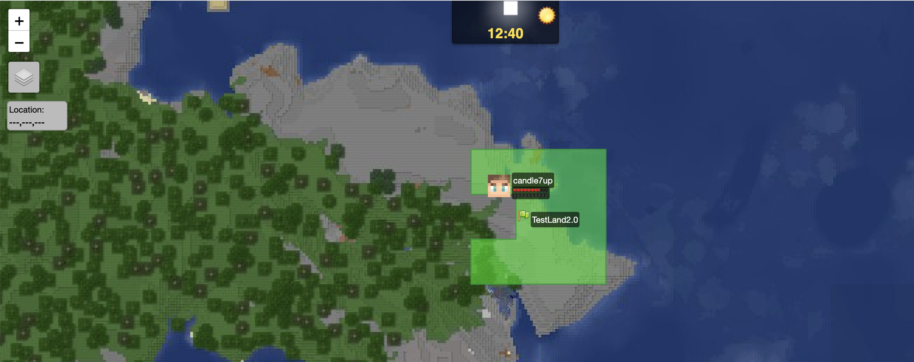
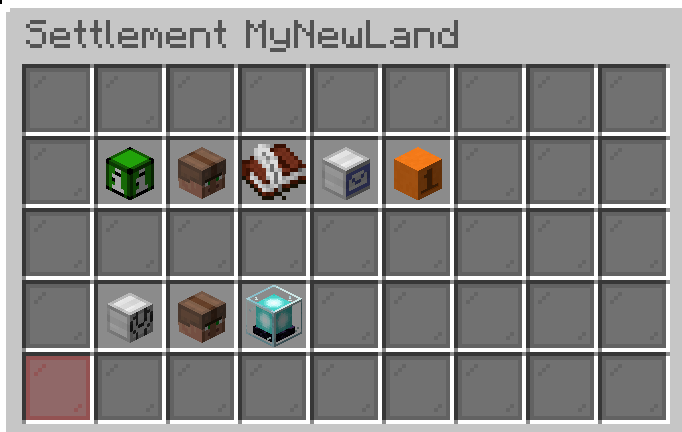
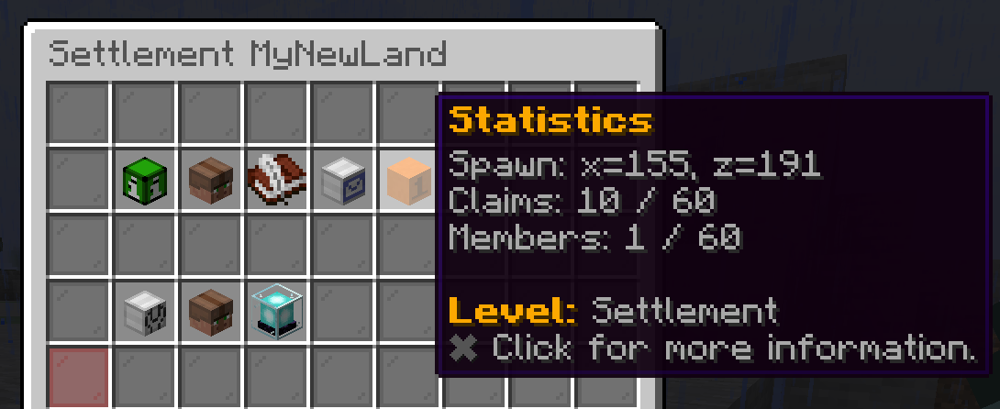
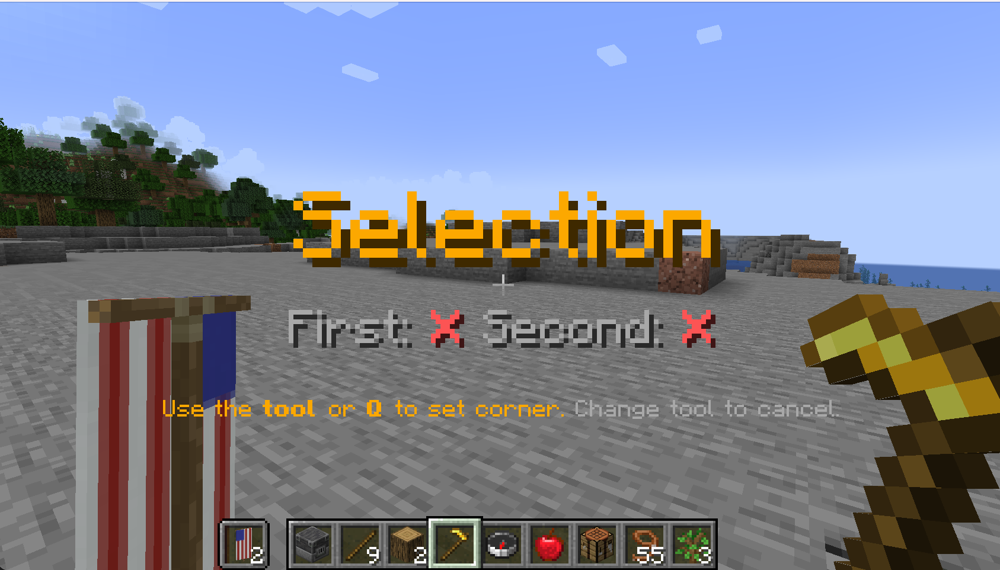
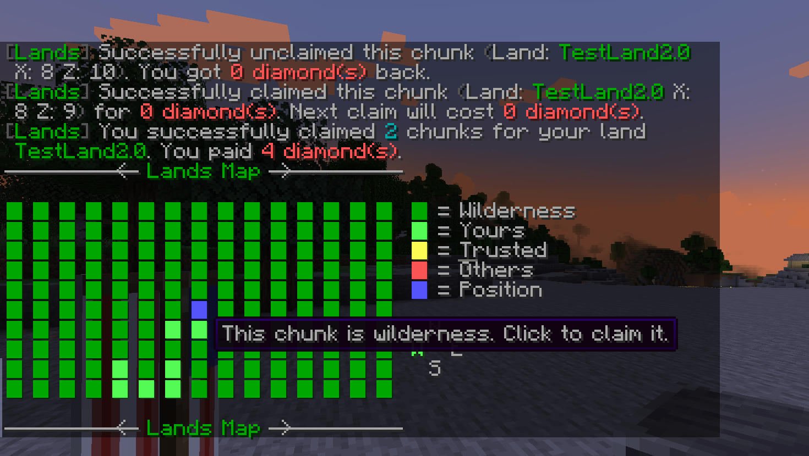
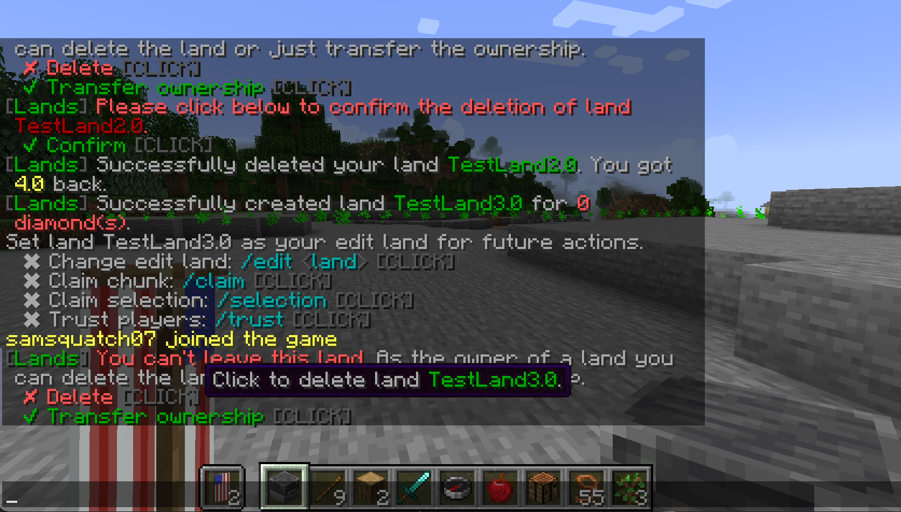

# :flag_us: Claiming & Managing Land

## Creating a Land

On this server, you can claim land within the Minecraft world. Claiming land will allow you to control members of the land and what those members are allowed to do. Additionally, players who are not members of your land, are unable to break blocks, build, or interact with items. 

Players inside your land will not be able to attack you or each other. *Note: Attacking players is never allowed in claimed land ([war feature coming soon](declaring_war.md))*.

To claim a new plot of land, stand in the chunk (16x16 minecraft blocks) that you want to claim, open up the chat, and type

`/lands create <name_of_land>`

*Replace `<name_of_your_land>` with the name you want your land to be (no spaces)*

and hit `ENTER`. The 16x16 block + a 1 chunk radius around that chunk will be initially claimed for free by your land. You should see a green border pop up that highlights the border of your land.

{ width=75% height=75% }

{ width=75% height=75% }

To make the highlighted border for your land reappear at any time, type `/lands view` and hit `ENTER`.

*Tip: A cool way to view your land border is to look at the [World Map](http://108.62.104.82:38305/?worldname=new-world-1.18&mapname=flat&zoom=3&x=250&y=64&z=250)*

{ width=75% height=75% }

## Managing Land

To open up the land management menu for your land, open the chat, and type

`/lands`

and hit `ENTER`. You will see a user interface with various options.

Most of the menu options should be fairly self-explanatory, however, see below for a brief description of each.

{ width=75% height=75% }

- `Trusted Players` - Get a list of trusted players of your land (see more in [Inviting Other Players to Your Land](inviting_friends.md#trusting-members-in-your-land))
- `Invites` - View the invites you've sent out to other players (see more in [Inviting Other Players to Your Land](inviting_friends.md))
- `Inbox` - Messages and notifications about your land
- `Statistics` - Show land level and claim limits (see more in [Leveling up Your Civilization](leveling_up_your_civilization.md))
- `Roles` - Show roles for your land (see more in [Inviting Other Players to Your Land](inviting_friends.md#managing-roles-and-priveleges-in-your-land))
- `Miscellaneous Settings` - Change land name and change messagep layers see when entering your land

## Claiming Additional Chunks

### Cost

All additional chunks after the initial claim, will cost `DIAMONDS`. The cost in `DIAMONDS` will be taken from your inventory when you claim a chunk.

The cost for the first new chunk of land will be `4 DIAMONDS`.  Every additional claim after that will cost an additional `2 DIAMONDS`. So for example, the third chunk you claim after creating your land will cost `8 DIAMONDS`. You can calculate this by taking:

$$
\text{cost in diamonds of next chunk} = 4 + (n - 9)*2
$$

Where `n` is the number of chunks your land currently has (we subtract 9 for the 9 initial chunks you get when creating a land).

*Tip: To view how many chunks your land currently has, highlight over the `Statistics` icon in the `/lands` menu. You should be able to see the number of chunks you currently have claimed for your land.*

{ width=75% height=75%}

### Claiming

To claim a chunk, make sure you have an appropriate amount of diamonds in your inventory. Stand over the chunk you want to claim, open up chat and type

```
/lands claim
```

and hit `ENTER`. The 16x16 chunk block you are standing in will now be claimed and added to your land.

You can also claim land through the `selection` tool and the `map` tool (see below).

```
/lands selection
```

{ width=75% height=75%}

```
/lands map
```

*Note: After hitting `ENTER`, open up chat again by pressing `T` to interact with the map*

{ width=75% height=75%}

### Unclaiming 

To unclaim a chunk, simply stand over the chunk you want to claim and type

```
/lands unclaim
```

and hit `ENTER`. The land will be unclaimed and the `DIAMONDS` spent on it will go back to your inventory.

### Claim Limits

Each player has a limit of `50` chunks they can ***either*** claim for their own land ***or*** contribute to another player's land that they are a trusted member of. A player **cannot own their own land and belong to another player's land** (see more in [Inviting Other Players to your Land](inviting_friends.md)).

Each trusted player in your land will increase your budget by `50`. You can edit the roles for trusted members to allow them to claim chunks for your land (see more in [Inviting Other Players to your Land](inviting_friends.md#managing-roles-and-priveleges-in-your-land)).

## Deleting Your Land

To delete your land completely, type

```
/lands delete <name_of_your_land>
```

*Replace `<name_of_your_land>` with the name of your land*

and hit `ENTER`. The `DIAMONDS` spent on all claimed chunks will be returned to your inventory.

## Leave Your Land

You can leave your own land by typing

```
/lands leave <name_of_your_land>
```

*Replace `<name_of_your_land>` with the name of your land*

This will give you the option to either leave the land and transfer ownership to another member, or delete it.

*Note: After pressing `ENTER` on the above command, open chat again with `T` to click on either option.*

{ width=75% height=75%}
