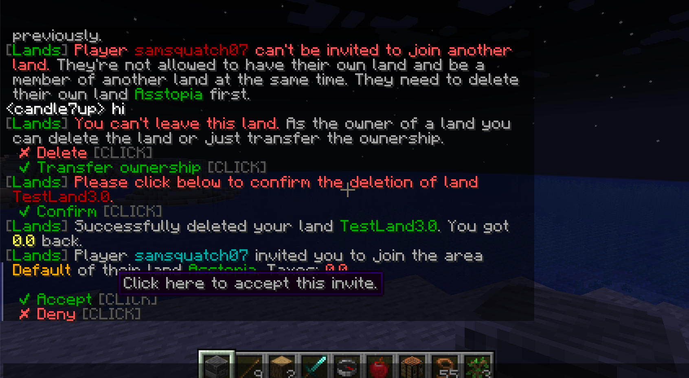
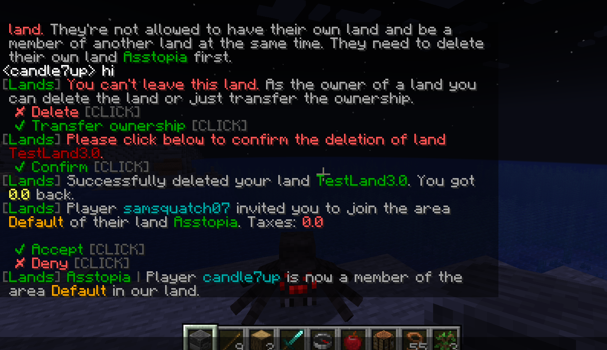
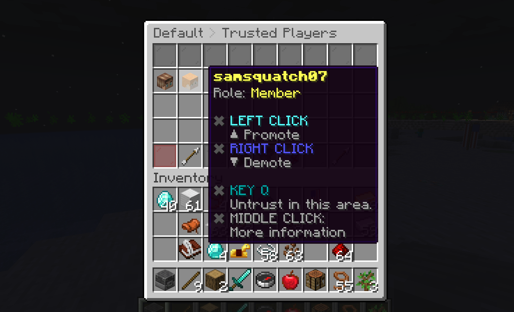
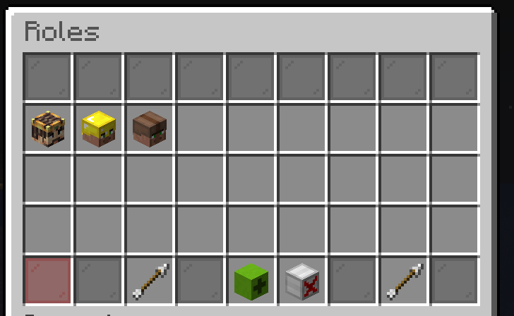
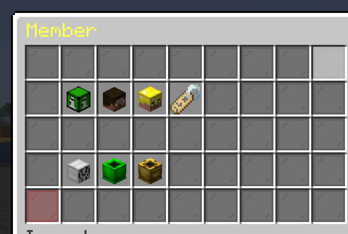
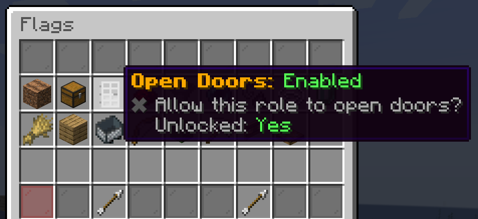

# :handshake: Inviting Other Players to your Land

## Trusting Members in Your Land

Any player who enters your land will not be able to interact with it in any way or attack players unless they are trusted members of your land. 

*Note: Non-trusted players have the `Visitor` role in your land (see [Default Roles](#default-roles))*

*Note: Attacking players is never allowed in a claimed land ([war feature coming soon](declaring_war.md))*

To trust a player in your land, type

```
/lands trust <player_name>
```

*Replace `<player_name>` with the name of the player you want to trust.*

and hit `ENTER`. That player will now be invited to be a trusted member of your land.

Before you can join another player's land, or they can join your land, the player joining must [leave any land they might currently belong to](#leaving-a-land-you-are-trusted-in). If they own a land, they must [leave it and transfer ownerhip to a different player](claiming_land.md#leave-your-land), or [delete the land](claiming_land.md#deleting-your-land).

## Accepting an Invite to a Land

If a player sends you an invite to be a trusted member of their land, you should see a message pop up like the one below.

{ width=75% height=75% }

Press `T` to open the chat menu and click on either `Accept` or `Deny`. Clicking `Accept` will make you a trusted member of this land and initially put you in the `Member` role for that land.

{ width=75% height=75% }

## Viewing Trusted Members

In the `/lands` menu, click on `Trusted Players` and you should see the member you trusted listed.

{ width=75% height=75% }

By default, new trusted members will be added to the role `Member` (see more in [Managing Roles and Priveleges in your Land](#managing-roles-and-priveleges-in-your-land)).

## Untrusting Trusted Members

To untrust a trusted member, type

```
/untrust <player_name>
```

*Replace `<player_name>` with the name of the player you want to untrust.*

The player will now be considered a `Visitor` role when in your land.

## Leaving a Land You are Trusted In

To leave a land you are currently trusted in, simply type

```
/lands leave <name_of_land>
```

and press `ENTER`. You will now be considered a `Visitor` in that land.

## Managing Roles and Priveleges in your Land

### Default Roles

There are default roles that exist when you create a land.  These roles cannot be deleted. You can still [manage flags](#granting-priveleges-to-a-role) for these roles (except the `Owner` role).

+ `Owner` - The owner of the land - this is the person who created the land, or the person who had land ownership transferred to them when the previous owner left the land. Only one member can have this role for a single land at any given time. Flags **cannot** be edited for the owner role. Members cannot be promoted to this role, unless the current owner [leaves the land](claiming_land.md#leave-your-land)
+ `Member` - Anyone who is `/trusted` in this land receives this role by default.
+ `Visitor` - Anyone who is not `/trusted` in your land has this role.

### Adding a New Role

Open up the `/lands` menu, and go to the `Roles` section. Here you can create new roles and manage permissions for roles.

{ width=75% height=75% }

The position of the role from left to right is the direction players will be promoted/demoted. Press `SHIFT + RIGHT CLICK` and `SHIFT + LEFT CLICK` to reorder roles

### Adding Members to a Role

To add a member to a role go to the [Trusted Players](#viewing-trusted-members) menu. `LEFT CLICK` a player's head to promote them, and `RIGHT CLICK` a player's head to demote them.

### Editing a role

From the `Roles` menu, you can click on a role icon to go to the edit menu for the role. From here you can select the following different menu options:

{ width=75% height=75% }

- **Role Members**: View all members that belong to this role
- **Icon**: Change the icon of the role to the item you are holding in your hand
- **Rename**: Rename the role
- **Action Flags**: Manage `Action Flags` for the role (see [Granting Priveleges to a Role](#granting-priveleges-to-a-role))
- **Management Flags** Manage `Management Flags` for the role (see [Granting Priveleges to a Role](#granting-priveleges-to-a-role))

### Granting Priveleges to a Role

Go to the [edit menu](#editing-a-role) for the role. Click on either `Action Flags` or `Management Flags` to manage action and management flags.

`Action Flags`: Control what players with this role can do within your land (e.g. break blocks or open containers). 

`MANAGEMENT FLAGS` Control what players with this role can manage in your land (e.g. claim additional chunks for the land, trust players in the land).

To enable/disable the flag for a role, simply click on the icon for it. The current status of the flag (`Enabled` or `Disabled`) is shown in the tooltip.

{ width=75% height=75% }

## Getting Unstuck

Since `Visitors` in a land will not be able to break blocks, it may be possible for someone to get stuck in another player's land that they are not a member of. To get unstuck simply type:

```
/lands unstuck
```

and press `ENTER`. You will be teleported to the nearest wilderness location. There is a five minute cooldown for this action.
