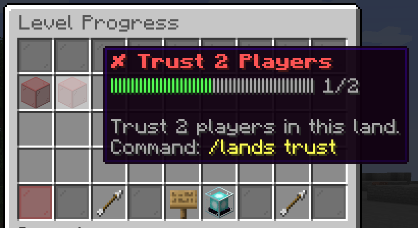
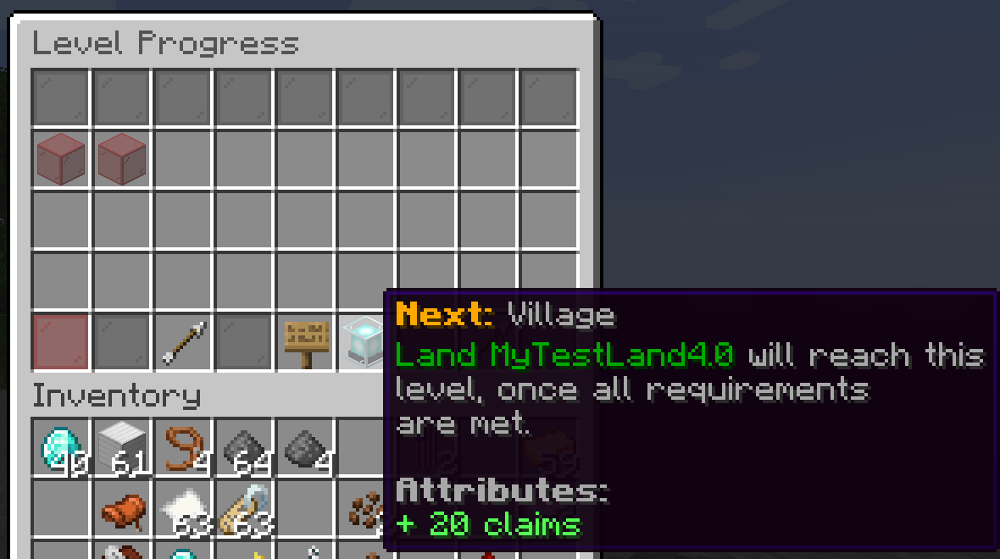

# :arrow_up: Leveling up your Civilization

## Level Descriptions

You can increase the chunk claim limit of your land by adding new members to your land. Additionally, if you meet the requirements to level up your land, you will also gain bonuses to your chunk claim limit depending on your land's level.

The levels, requirements and rewards can be seen below:

| Level | Name       | Requirements                              | Reward                  |
| ----- | ---------- | ----------------------------------------- | ----------------------- |
| 1     | Settlement | None                                      | `+10` Additional Chunks |
| 2     | Village    | `2` trusted members & `20` claimed chunks | `+20` Additional Chunks |
| 3     | Town       | `3` trusted members & `30` claimed chunks | `+30` Additional Chunks |
| 4     | Province   | `4` trusted members & `40` claimed chunks | `+40` Additional Chunks |
| 5     | Kingdom    | `5` trusted members & `50` claimed chunks | `+50` Additional Chunks |
| 6     | Village    | `6` trusted members & `60` claimed chunks | `+60` Additional Chunks |

## Viewing Your Land's Current Level

To view your land's current level, and remaining requirements to level up, open the `/lands` menu. Click on the `Statistics` menu, and then `Levels` menu. You should be able to highlight over the requirements and the next level to view more information about them.

{ width=75% height=75% }

{ width=75% height=75% }