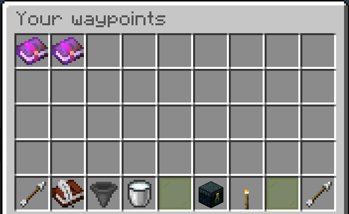
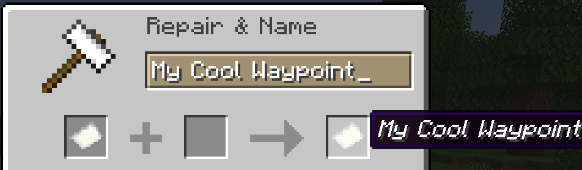
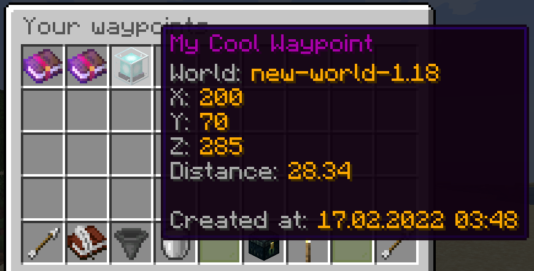
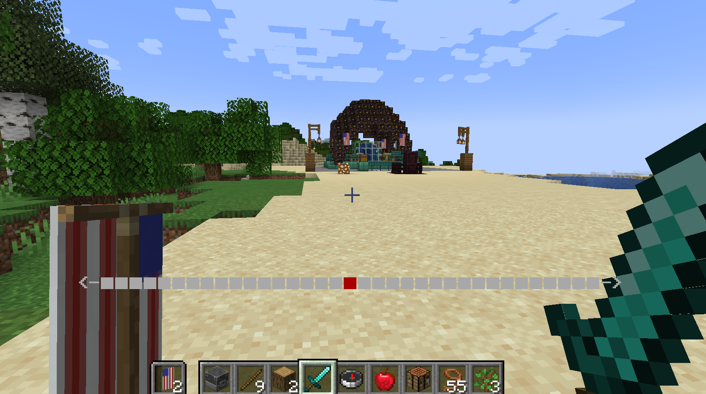

# :compass: Waypoints

## Access Waypoints Menu

To access the waypoints menu, open chat and type `/waypoints` and hit `ENTER`.

You should see a menu pop up that. Highlighting over the various icons will tell you what they do.

{ width=75% height=75% }

## Create a New Waypoint

Open the waypoints menu (`/waypoints` + `ENTER`).

Click the `TORCH` icon. A menu will pop up. Enter the name of your waypoint, and click the paper icon to confirm.

{ width=75% height=75% }

Open the waypoints menu (`/waypoints` + `ENTER`). You should now see your waypoint in the menu.

{ width=75% height=75% }

## Activate Waypoint

Open the waypoints menu (`/waypoints` + `ENTER`).

Click on the waypoint you want to activate (`BEACON` icon).

In the following menu, click the `REDSTONE` icon to activate your waypoint.

All compasses will now point to the waypoint. Additionally, you will have a horizontal bar map on your screen that points in the direction of the waypoint. As you get closer you will also see a flashing beacon (`GLOWSTONE` + `GLASS_BLOCK`).

{ width=75% height=75% }